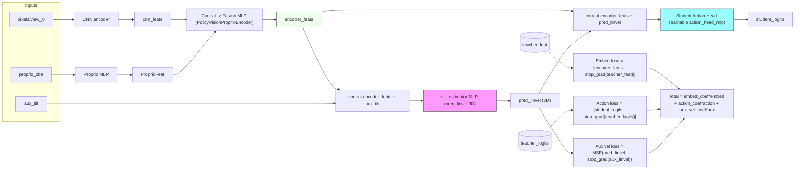

> [!IMPORTANT]
> **🚧 Active Branch**
## 🚧 Gaussian Splatting Rendering for Sim-to-Real Transfer
Enhancing MuJoCo Playground with GPU-accelerated 3DGS for zero-shot sim-to-real transfer.


### 🗺️ Roadmap

| | Task | Notes |
|:--:|------|-------|
| ✅ | **GS rendering with CUDA kernels** | batch vmap axis for parallelized environment rendering: Gym-like step API preserved · [`./jax_gsplat`](jax_gsplat/) |
| (~) | **Scene generation pipeline** | Compositing done · surface mesh generation in progress · [`./scene_pipeline`](scene_pipeline/) |
| (  ) | **Data augmentation** | Heavy augmentation + domain randomization pipeline |
| (  ) | **DAgger IL (full GS pipeline)** | Student distillation end-to-end with GS rendering for sim-to-real |

### 📚 GS References

| | Reference |
|--|-----------|
| **3DGS** | B. Kerbl, G. Kopanas, T. Leimkühler, G. Drettakis. "3D Gaussian Splatting for Real-Time Radiance Field Rendering." *ACM Transactions on Graphics*, 42(4), SIGGRAPH 2023. [[paper]](https://repo-sam.inria.fr/fungraph/3d-gaussian-splatting/) [[code]](https://github.com/graphdeco-inria/gaussian-splatting) |
| **gsplat** | V. Ye, R. Li, J. Kerr, M. Turkulainen, B. Kim, Z. Chen, N. Holden, O. Johannsen, A. Bhatt, B. Kerbl, M. Tancik, A. Kanazawa. "gsplat: An Open-Source Library for Gaussian Splatting." *arXiv preprint*, 2024. [[code]](https://github.com/nerfstudio-project/gsplat) |
| **jaxsplat** | Y. Kim. "jaxsplat: JAX bindings for differentiable 3DGS rendering." [[code]](https://github.com/yklcs/jaxsplat) |
| **mesh2splat** | GaussianAnything. "mesh2splat: Training-free mesh-to-Gaussian conversion." [[code]](https://github.com/GaussianAnything/mesh2splat) |
| **GaussGym** | GaussGym. "RL environment with Gaussian Splatting rendering" — re-implemented here in JAX with `vmap`. |

---


# ARCDRONE


**Pixel-to-action autonomous landing policy** for the Aerospace Research Lab (ARC) at the Universidad de Piura (UDEP).

Training, physics simulation, and rendering are GPU-accelerated end-to-end via [MuJoCo Playground](https://github.com/google-deepmind/mujoco_playground) with the Warp ray-tracing backend.


## Methodology

The project addresses autonomous drone landing through **teacher-student imitation learning**:

1. A **teacher** policy is trained via reinforcement learning with access to the full privileged state (position, velocity, target location).
2. A **student** policy then learns to replicate the teacher's behavior using only onboard observations (camera pixels + IMU) through the [DAgger](https://arxiv.org/abs/1011.0686) algorithm.

Additionally, code for a **Student-Informed Teacher Training (SITT)** approach from [Bonatti et al. (2024)](https://arxiv.org/abs/2412.09149) is included. SITT addresses a known limitation of standard distillation: the teacher may produce demonstrations that are infeasible for the student's restricted observation space. SITT is still under development.

### Observations

The student policy receives two observation channels:

- **`pixels/view_0`** -- Grayscale 64x64 frames from a downward-tilting onboard camera, stacked over 5 time steps (with frame-skip of 2) plus 4 frame-difference channels as an optical-flow proxy. Total: 9 channels.
- **`proprio_obs`** -- Proprioceptive vector (flattened): action history, linear acceleration, angular velocity, orientation quaternion, and camera tilt angle/velocity -- all buffered over 3 time steps.


### Action Space

The policy outputs 5 continuous actions in [-1, 1], linearly mapped to actuator control ranges:

| Index | Actuator | Description |
|-------|----------|-------------|
| 0-3 | Rotors 1-4 | Thrust commands |
| 4 | Camera tilt | Hinge joint controlling the onboard camera pitch |

### Network Architecture and Loss

The vision policy trains easily when ground-truth velocity is available as a proprioceptive signal. In practice, however, velocity is not directly measurable onboard. We therefore estimate it with an auxiliary MLP and feed the prediction back into the action head. Beyond this, the architecture follows a standard CNN-to-MLP pipeline.



## Installation

### Prerequisites

- Python >= 3.10 (tested with 3.12)
- NVIDIA GPU with CUDA 12+ and cuDNN
- [uv](https://docs.astral.sh/uv/) (recommended) or pip

### Setup

1. **Clone and install MuJoCo Playground** (pinned commit for reproducibility):

```bash
git clone https://github.com/google-deepmind/mujoco_playground.git
cd mujoco_playground
git checkout d43c7216bc892d59237335e83fa60c6da77a2698
uv venv .venv --python 3.12
source .venv/bin/activate
uv pip install -U "jax[cuda12]"
uv pip install -e ".[all]"
```

2. **Clone and install this project** (from the repo root, inside the same venv):

```bash
git clone <this-repo-url> arcdrone && cd arcdrone
uv pip install -e ".[ml]"
```


3. **EGL rendering** (headless GPU environments -- RunPod, Docker, SSH):

```bash
sudo apt-get install -y libegl1 libgles2 libgl1 libglfw3 libosmesa6
```

4. **Verify**:

```bash
python -c "
import jax; print('JAX', jax.__version__)
import mujoco; print('MuJoCo', mujoco.__version__)
from mujoco import mjx
import brax; print('Brax', brax.__version__)
print('All good')
"
```

<details>
<summary><b>Tested package versions</b></summary>

| Package | Version |
|---------|---------|
| jax | 0.6.2 |
| brax | 0.14.1 |
| flax | 0.11.2 |
| optax | 0.2.6 |
| mujoco | 3.6.0 |
| mujoco-warp | 3.6.0 |
| warp-lang | 1.12.0 |
| hydra-core | 1.3.2 |
| omegaconf | 2.3.0 |
| wandb | 0.25.1 |

</details>

> **RunPod / Docker users:** A ready-to-use Dockerfile is provided in `docker/`. See `docker/README.md` for the RunPod start command.

## Scripts

### Training

**Teacher** (privileged-state RL):

```bash
python src/arcdrone/priviledged_landing_rl/train.py \
  train.num_envs=1024 \
  train.num_timesteps=1000000 \
  train.num_evals=20 \
  train.num_eval_envs=128 \
  train.unroll_length=32 \
  train.batch_size=512 \
  train.num_minibatches=16 \
  train.num_updates_per_batch=4 \
  train.use_wandb=true \
  train.wandb_run_name=teacher_training \
  train.seed=42
```

A pre-trained teacher checkpoint is available at:

```
checkpoints/teacher_model.pkl
```

**Student** (DAgger distillation):

```bash
python src/arcdrone/New_attempt_2/train.py \
  train.teacher_checkpoint_path=outputs/2026-04-13/17-10-10/teacher_model.pkl \
  train.restore_params_path=outputs/2026-04-17/18-54-38/trained_model.pkl \
  train.num_dagger_epochs=4000 \
  train.learning_rate=1e-4 \
  train.beta_start=0.5 \
  train.beta_end=0.1 \
  train.beta_schedule=cosine \
  train.align_action_coef=2.0 \
  train.align_embed_coef=0.3 \
  train.aux_vel_coef=1.0 \
  +train.augment_strength=0.3 \
  +train.teacher_noise_std=0.03 \
  train.seed=42 \
  train.use_wandb=false
```

A pre-trained student checkpoint is available at:

```
checkpoints/trained_model.pkl
```

> **Work in progress:** (1) Student training with SITT -- see `src/arcdrone/vision_landing_sitt/`. (2) Vision-policy fine-tuning with RL -- see `src/arcdrone/vision_landing_rl/`.

### Evaluation

A single unified evaluator (`evaluate.py`) supports three modes via the `--mode` flag:

| Mode | Description |
|------|-------------|
| `gui` | Launch the MuJoCo viewer and watch the drone fly in real time. Reports per-episode reward breakdown and real-time rate. |
| `batch` | Headless batched rollouts (default). Reports distance-to-target statistics, success/crash/timeout rates, and optionally exports JSON. Supports multi-checkpoint comparison. |
| `diagnostic` | Step-by-step debugger. Prints the full drone state (position, velocity, orientation, reward components, camera visibility) at every time step. |

```bash
# Watch the student land in the GUI
python src/arcdrone/vision_landing_dagger/evaluate.py \
  --mode gui --checkpoint checkpoints/trained_model.pkl --episodes 20

# Headless benchmark (256 episodes, export JSON)
python src/arcdrone/vision_landing_dagger/evaluate.py \
  --mode batch --checkpoint checkpoints/trained_model.pkl \
  --episodes 256 --batch_envs 64 --json_out results.json

# Step-by-step debug (3 episodes)
python src/arcdrone/vision_landing_dagger/evaluate.py \
  --mode diagnostic --checkpoint checkpoints/trained_model.pkl --episodes 3

# Evaluate teacher baseline
python src/arcdrone/vision_landing_dagger/evaluate.py \
  --mode batch --policy teacher \
  --teacher_checkpoint checkpoints/teacher_model.pkl --episodes 100
```

### Other Scripts

The `tools/` directory contains utilities for MuJoCo visualization and rendering the agent's pixel observations during rollouts.

## Future Work

- **Sim-to-real transfer:** Fine-tune the pixel policy on outdoor Gaussian Splatting scenes with domain randomization to close the visual gap.
- **SITT integration:** Further develop the Student-Informed Teacher Training pipeline.
- **Hardware deployment:** Real-world flight tests after procuring the target drone platform.

## References

1. S. Ross, G. Gordon, and D. Bagnell. "A Reduction of Imitation Learning and Structured Prediction to No-Regret Online Learning." *Proceedings of the 14th International Conference on Artificial Intelligence and Statistics (AISTATS)*, 2011. [arXiv:1011.0686](https://arxiv.org/abs/1011.0686)

2. N. Messikommer, J. Xing, E. Aljalbout, D. Scaramuzza. "Student-Informed Teacher Training." *arXiv preprint*, 2024. [arXiv:2412.09149](https://arxiv.org/abs/2412.09149)

3. Skydio X2 drone model from MuJoCo Menagerie (modified for onboard camera mount and Warp compatibility). [GitHub](https://github.com/google-deepmind/mujoco_menagerie/blob/main/skydio_x2/README.md)
